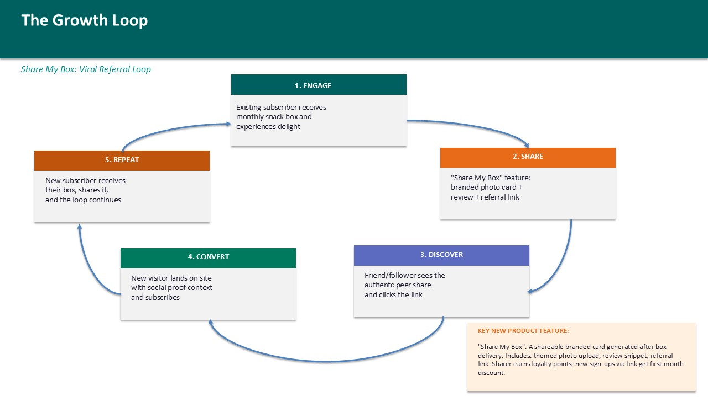
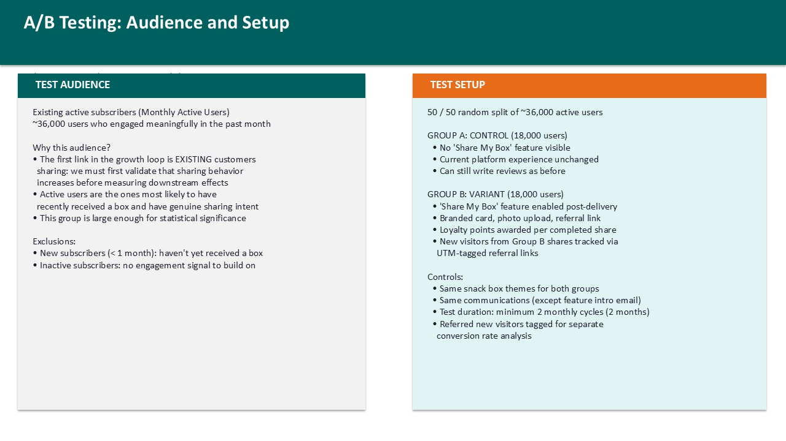
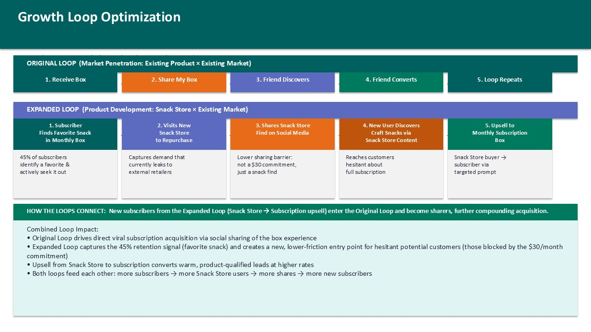

# Craft Snacks: Growth Loop Initiative

This project presents a growth strategy for Craft Snacks, a monthly artisan-snack subscription. The proposal turns existing customer enthusiasm into a measurable referral loop designed to grow new monthly subscribers sustainably.

## Goal

Increase new monthly subscribed users by **20% month over month** over one quarter, growing from 2,100 to approximately 3,629 monthly subscribers. The strategy focuses on compounding acquisition rather than a one-time campaign spike.

## Growth strategy

The analysis uses the **AARRR framework** to connect the customer journey with the metrics that matter:

- **Acquisition:** new visitor sessions, channel mix, and social-referral traffic.
- **Activation:** visitor-to-subscriber conversion rate and new monthly subscribers.
- **Retention:** monthly active users, theme engagement, reviews, and repeat sharing.
- **Referral:** customer social-sharing behavior and referral-link engagement.
- **Revenue:** monthly subscribers and recurring subscription revenue.

The primary metric is new monthly subscribed users. Upstream metrics include visitor sessions, conversion rate, sharing rate, and social-referral traffic; downstream metrics include total subscribers, MAU, reviews, and repeat sharing.

## The proposed loop: Share My Box

`Share My Box` is a post-delivery sharing feature that creates a branded card with a themed photo, review snippet, and tracked referral link. Existing subscribers receive loyalty points for successful referrals, while referred visitors receive a first-month offer.

The loop follows five steps: receive the box, share the experience, enable peer discovery, convert a new subscriber, and repeat. It is grounded in existing behavior: customers already share snack-box content organically, while potential customers need more trust and social proof before subscribing.

## Validation plan

The deck translates the loop into a controlled A/B test for active subscribers:

- 50/50 randomized split across approximately 36,000 active subscribers.
- Two monthly cycles to distinguish sustained adoption from novelty effects.
- UTM-tagged referral links to measure downstream traffic and conversion.
- Primary measures: share-button clicks, completed shares, referral traffic, conversion lift, new-subscriber sharing, and viral coefficient (K-factor).

The plan also addresses selection bias, novelty effects, social contamination, and incentive-driven low-quality sharing.

## Future growth vision

The strategy uses the **Ansoff Matrix** to frame expansion options. The initial sharing loop is market penetration: an existing product for an existing market. The recommended extension is product development through a Snack Store that lets subscribers repurchase favorite items, creates a lower-friction entry point for prospective customers, and feeds qualified buyers into the subscription loop.

## Deliverables

- [Editable presentation](Craft_Snacks_Growth_Initiative.pptx)
- [Presentation PDF](Craft_Snacks_Growth_Initiative.pdf)

## Methods used

- AARRR funnel analysis
- Primary and secondary metric trees
- Persona research and problem framing through Resources, Values, Hurdles, and Goals
- Growth-loop design and step-level hypotheses
- Controlled A/B testing and risk mitigation
- Viral-coefficient measurement
- Ansoff Matrix expansion analysis
